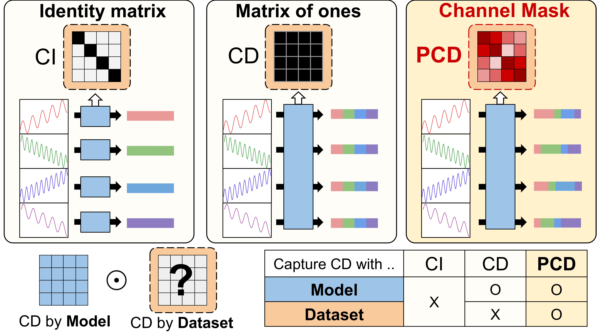
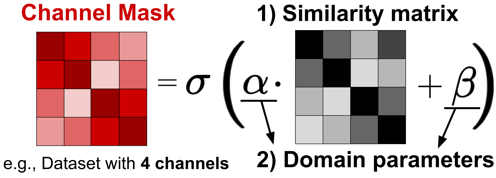

## Dataset-Driven Channel Masks in Transformers for Multivariate Time Series

[](https://arxiv.org/abs/2410.23222)


<br>

This repository contains the official implementation of the paper  
> **[Dataset-Driven Channel Masks in Transformers for Multivariate Time Series](https://arxiv.org/abs/2410.23222)**  
> **Seunghan Lee**, **Taeyoung Park**, and **Kibok Lee**

<br>

```bibtex
@inproceedings{lee2026dataset,
  title     = {Dataset-Driven Channel Masks in Transformers for Multivariate Time Series},
  author    = {Lee, Seunghan and Park, Taeyoung and Lee, Kibok},
  booktitle = {Proceedings of the IEEE International Conference on Acoustics, Speech and Signal Processing (ICASSP)},
  year      = {2026}
}
```

<br>

### **Publication status**
- A preliminary version was presented at the **NeurIPS Workshop on Time Series in the Age of Large Models, 2024** *(Oral presentation)*.
- The full paper has been **accepted to ICASSP 2026**.

<br>

### **Overview of Partial Channel Dependence (PCD)**

<div align="center">
  <a href="images/PCD.pdf">
    
  </a>
  <!-- \hspace{~30px} -->
  <span style="display:inline-block; width:330px;"></span>
  <a href="images/CM.pdf">
    
  </a>
</div>

<br>

### **PyTorch Example: CI vs. CD vs. PCD**

```python
import torch
import torch.nn.functional as F

def compute_channel_mask(R, alpha, beta):
    """
    R     : [C, C] similarity matrix (e.g., correlation)
    alpha : scalar or [1] learnable domain parameter
    beta  : scalar or [1] learnable domain parameter
    """
    # absolute correlation
    R = R.abs()

    # mean normalization (dataset-level)
    R_bar = R - R.mean()

    # domain-specific refinement
    M = torch.sigmoid(alpha * R_bar + beta)
    return M


def attention(Q, K, V, mode="PCD", R=None, alpha=None, beta=None):
    """
    Q, K, V : [B, C, d]
    mode    : 'CI', 'CD', or 'PCD'
    """
    C = Q.size(1)
    scores = torch.matmul(Q, K.transpose(-1, -2)) / (Q.size(-1) ** 0.5)

    # Select adjustment matrix A
    if mode == "CI":
        A = torch.eye(C, device=Q.device)          # Channel-Independent
    elif mode == "CD":
        A = torch.ones(C, C, device=Q.device)      # Channel-Dependent
    elif mode == "PCD":
        A = compute_channel_mask(R, alpha, beta)   # Partial CD
    else:
        raise ValueError("Unknown mode")

    # Adjust attention
    scores = scores * A
    attn = F.softmax(scores, dim=-1)
    return torch.matmul(attn, V)
```

<br>

### **Applications**

- **Single-task models**: [iTransformer](https://arxiv.org/pdf/2310.06625), [CARD](https://arxiv.org/pdf/2305.12095), [PRformer](https://arxiv.org/pdf/2408.10483), [Minusformer](https://arxiv.org/pdf/2402.02332)
- **Time series foundation model**: [UniTS](https://arxiv.org/pdf/2403.00131)

<br>

### Acknowledgement

We appreciate the following GitHub repositories for their valuable codebases and datasets:

- [iTransformer](https://github.com/thuml/iTransformer)
- [CARD](https://github.com/wxie9/CARD)
- [PRformer](https://github.com/usualheart/PRformer)
- [Minusformer](https://github.com/Anoise/Minusformer)
- [UniTS](https://github.com/mims-harvard/UniTS)
