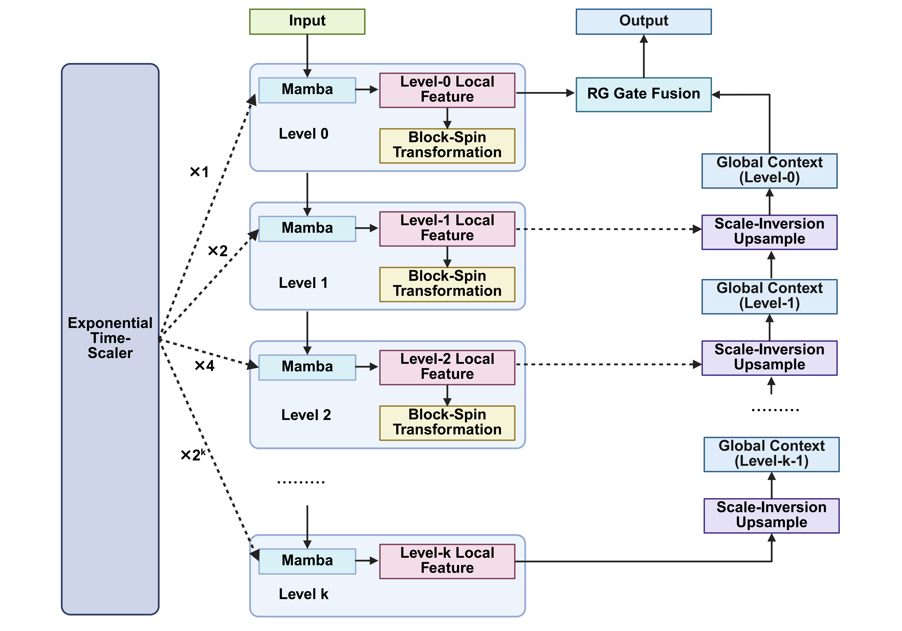

# Dynamic Fractal Mamba: A Neural Renormalization Group Flow for Scale-Invariant Sequence Modeling

Shenglei Fang, Xianfang Sun, You Zhou


This is code for paper "Dynamic Fractal Mamba: A Neural Renormalization Group Flow for Scale-Invariant Sequence Modeling" in ICML 2026.

## Abstract

Sequence models typically operate at a fixed temporal or spatial scale and struggle to generalize to substantially longer horizons or higher resolutions without retraining. Existing hierarchical architectures expand receptive fields but rely on scale-specific parameters and lack mechanisms to enforce consistent dynamics across scales. We propose Dynamic Fractal Mamba (DF-Mamba), a recursive state-space model that applies a single shared operator across multiple scales. By sharing parameters across recursion depths and exponentially scaling the effective time step, DF-Mamba achieves an exponentially expanding receptive field while preserving linear computational complexity. A learned content-aware coarse-graining module aggregates representations across scales. Auxiliary reconstruction and cross-scale consistency objectives stabilize recursive training. We evaluate DF-Mamba on long-range time-series forecasting, spatial transcriptomics, and computational pathology. Across all tasks, DF-Mamba consistently outperforms Transformers and flat Mamba baselines while using fewer parameters and maintaining linear-time scalability. Importantly, models trained on short sequences or low-resolution inputs generalize in a zero-shot manner to substantially larger temporal and spatial scales unseen during training. These results demonstrate that recursive parameter sharing provides an effective inductive bias for learning scale-consistent and efficient sequence representations.

<p align="center">
  
</p>

<p align="center">
  <em>Overview of the proposed Dynamic Fractal Mamba architecture.</em>
</p>


## Requirements

The implementation is written in PyTorch and does not require the official `mamba-ssm` package or any custom CUDA extensions.

Tested with:

- Python >= 3.9
- PyTorch >= 2.0
- CUDA-compatible GPU is recommended but not required

## Quick Start

Clone the repository and create a clean Python environment:

```bash
git clone https://github.com/Fcam34/Dynamic-Fractal-Mamba.git
cd Dynamic-Fractal-Mamba

conda create -n dfmamba python=3.10 -y
conda activate dfmamba

```

Run the minimal DF-Mamba implementation:

```bash
python DFmamba.py
```

Run the time-series forecasting experiment:
```bash
python DF-Mamba-TS.py
```
Run the spatial transcriptomics experiment:
```bash
python DF-Mamba-ST.py
```


## Citation
